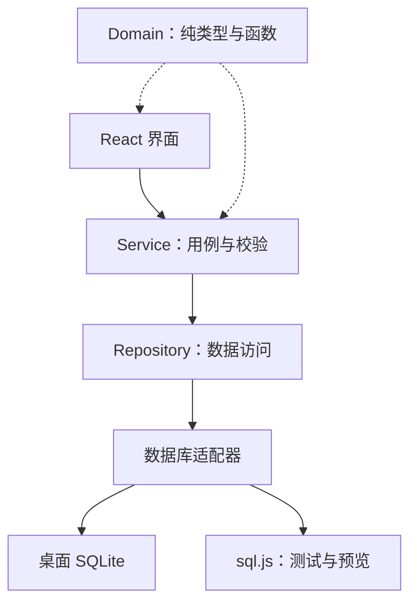

# PantryPilot 项目说明：从 V0.2 基础版到可展示的开源项目

> 本文件是一份可以单独阅读的完整说明，方便交给 ChatGPT 等 AI 助手讨论或修改计划。
> 日常进度勾选在 [`ROADMAP.md`](../ROADMAP.md)；代码结构细节见 [`ARCHITECTURE.md`](../ARCHITECTURE.md)。
> 最后更新：2026-10-05。仓库：https://github.com/JYifei/pantrypilot
> 实施状态：V0.1/V0.2 基础功能已实现；第 9 节第一轮 P0-A（可靠写入）已推送并通过 CI；第二轮 P0-B（可靠匹配）代码已完成并在本地提交，尚未推送，等待用户桌面验收；其余新任务尚待执行。第 8 节是代码核对（P0-A 之前的状态），第 9 节是分轮 Cursor 指令。
> 本次修订更新项目说明与执行计划，未修改 GitHub 仓库源码，也未发布新版本。

---

## 1. 项目是什么

PantryPilot（暂定名）是一个**本地优先、完全离线**的桌面应用，面向经常自己做饭的人：

- 按照（日本）超市里食材真实的样子记录库存，例如"牛 / 板腱（ミスジ）/ 排（ステーキ用）/ 251 g / 35 mm 厚"；
- 根据库存计算营养；
- 根据库存推荐"现在能做什么菜"，做完一键扣减库存。

它**不是**减肥或卡路里计数应用，**不提供任何医疗建议**。

用户本人在日本生活，母语中文，所以界面默认简体中文，同时支持英文和日文，食材名三语都有。

---

## 2. 必须遵守的约束（修改计划时请保持）

1. **隐私与离线**：不使用 Supabase / Firebase / 账号系统 / 云数据库 / 外部 API / 统计分析 / 遥测 / 后端服务器。所有个人数据只保存在用户自己的电脑上（一个 SQLite 文件）。
2. **营养数据诚实**：不得编造看起来很权威的营养数值。内置数据目前是"演示数据"，界面上明确标注。"未知"和"0"必须严格区分。
3. **不提供医疗建议**，不设定"目标摄入量"之类的东西。
4. **界面文字不能硬编码**：组件里不能直接写中文等界面文案，必须走 i18n（三个语言文件），有 ESLint 规则和测试检查。
5. **React 组件里不能写 SQL**：数据访问只能经过 Service → Repository/持久化层。为实现真实事务，可以在这一边界后增加 Rust 持久化模块；不能把 SQL 移入 React。
6. **已发布的数据库迁移文件不能修改**，只能新增迁移。（迁移文件的校验值会被记录，改动哪怕只是换行符都会导致应用启动失败。项目已用 `.gitattributes` 固定 LF 换行。）
7. **暂不添加许可证文件**（用户尚未决定）。
8. 大模型（LLM）功能如果以后加入，必须**默认关闭**、作为可选的输入方式，应用在没有它时仍完全离线可用，且大模型不能成为数据存储。

---

## 3. 技术栈

| 方面     | 选择                                                                 |
| -------- | -------------------------------------------------------------------- |
| 桌面外壳 | Tauri 2（Rust）                                                      |
| 前端     | React 19 + TypeScript（strict）+ Vite                                |
| 数据库   | SQLite（`tauri-plugin-sql`）；测试和浏览器预览用 sql.js（WASM）      |
| UI       | Tailwind CSS 4 + shadcn/ui（Radix）+ Lucide 图标 + sonner 提示       |
| 表单     | React Hook Form + Zod                                                |
| 多语言   | i18next（`zh-CN` 为基准，另有 `en-US`、`ja-JP`）                     |
| 测试     | Vitest（原项目记录为 152 个测试，本次没有重跑完整套件）              |
| 工具     | pnpm、ESLint、Prettier；`pnpm check` = 类型检查 + lint + 格式 + 测试 |

运行方式：`pnpm install` 后，`pnpm tauri dev` 启动桌面应用，`pnpm dev` 只启动浏览器预览。
数据库位置（Windows）：`%APPDATA%\dev.pantrypilot.desktop\pantrypilot.db`。

---

## 4. 架构概览



关键设计：

- **食材三层分离**：
  - 食材定义 `IngredientDefinition`：营养身份，如"牛板腱（生）"。内置的用稳定的 snake_case ID（如 `beef_misuji_raw`），用户自建的用 UUID。
  - 产品形态 `ProductForm`：排、烤肉片、薄切、肉馅……。单纯切割形态不直接改变营养身份；脂肪比例、混合肉、生熟或加工差异需要对应的食材身份或明确覆盖值，不能仅靠形态推断营养。
  - 库存批次 `InventoryLot`：你实际拥有的一包东西（重量、个数、厚度、购买日、到期日、存放方式等）。
- **库存流水**：数量增加、消耗、调整、丢弃记录 `InventoryTransaction`；做菜消耗带 `recipeId`。当前标记已开封、变更存放方式等元数据修改不都产生流水，尚无独立做菜 session。
- **营养计算**：按每 100 g 可食部计算；当前有缺失值时合计标记为"下限"，后续应说明重量和缺项假设；库存营养和菜谱匹配（P0-B 起）对带骨或整只食材都按可食率换算；菜谱每份营养仍按默认主料估算。
- **复杂字段存 JSON 列**（多语言文本、营养、菜谱用料等），因为它们总是整体读写、从不按字段查询。
- **数据库迁移**：SQL 文件同时被 Rust（`include_str!`）和 TS（`?raw`）使用。目前有两个迁移：`0001_initial_schema.sql`、`0002_recipes.sql`。
- **内置数据版本化**：内置食材和内置菜谱各有一个版本号，版本变化时重新写入，用户自己的数据不受影响。
- **备份格式**：JSON，带 `schemaVersion`（当前为 2）和逐级迁移链；导入前用 Zod 校验并检查引用完整性，然后整体替换用户数据。

---

## 5. 已实现的功能

### V0.1 基础版（已完成）

**食材体系**

- 内置约 40 种常见食材（肉、鱼、蛋、豆制品、蔬菜、主食等），中英日三语名称与别名。
- 牛、猪、鸡的部位枚举（含板腱 misuji、切り落とし、こま切れ、肉馅等），以及产品形态枚举。
- 日本超市标签文字到标准枚举的解析（只作为输入辅助）。
- 三语搜索：全角/半角、片假名/平假名归一化，按"完全匹配 > 前缀 > 包含"排序。
- 可以新建、编辑、删除自定义食材。正在被库存或自定义菜谱使用的食材不能删除。

**库存管理**

- 批次的增删改；消耗、调整、丢弃，以及标记已开封、切换存放方式、冷冻。数量操作记录流水；元数据变更当前不都记录流水。
- 剩余量不会变成负数，超量消耗会报错，不会悄悄截断。
- 到期状态：已过期 / 今天 / 明天 / 2–3 天内 / 正常 / 未设置。
- 按到期日排序、按分类筛选、搜索。
- 快速添加流程：食材 → 部位 → 形态 → 数量 → 日期，高级选项默认折叠。
- 个数与克数之间的估算换算（可手动覆盖）。

**营养**

- 每 100 g 可食部的营养数据，记录数据来源；内置数据标注为演示数据。
- 营养沙盒：自由组合食材和重量，看合计。
- 实验性的 1–10 启发式评分，只在运行时计算，不存入数据库，并标明是启发式。

**页面与设置**

- 概览：在库批次数、即将到期、已过期、估算总重量、优先处理清单。
- 库存页、营养页、食材库页、设置页。设置页包括语言、主题（含深色模式）、货币、地区、数据库位置、隐私说明，以及 JSON 导出/导入。

**工程**

- 浏览器预览模式（sql.js + localStorage），方便不启动 Tauri 时调试。
- 多语言测试：三个语言文件的键完全一致、占位符一致、代码中用到的键都存在。

### V0.2 菜谱（已完成）

- **菜谱数据模型**：名称、简介、份数、用时、标签、用料、调味料、步骤，名称与步骤均为三语文本。用料行支持三种特殊情况：
  - 可选（`optional`）：缺了也不影响"能做"。
  - 可替代（`alternatives`）：例如小松菜可以代替菠菜；米饭可以用约 0.45 倍重量的生米代替。
  - 同种肉任意部位（`anySpecies`）：例如牛排菜谱接受任何牛肉部位。
- **调味料**只作为文字列出，**不参与库存匹配**。这是有意的简化，避免要求用户记录酱油、盐的余量。
- **内置 16 道家常示例菜谱**（三语）：姜烧猪肉、亲子丼、青椒肉丝、盐烤三文鱼、味噌煮青花鱼、麻婆豆腐、豆腐菌菇味噌汤、香煎牛排、日式咖喱、炒乌冬、日式凉拌菠菜、小松菜炒鸡蛋、牛丼、鸡蛋炒饭、回锅肉、照烧鸡腿。界面标明用量是常见家常分量，不是专业测试过的食谱。
- **库存匹配**（纯函数，`src/domain/recipes/matching.ts`）：
  - 已过期和已用完的批次不参与匹配。
  - P0-B 起由一个分配器在所有用料行之间共享批次余额，得到每行"够 / 部分 / 没有 / 待确认"、实际批次用量和缺口；5% 只是提示容差，扣减不超过库存。规则见 `docs/adr/0002-recipe-allocation.md`。
  - 整道菜分为四档：
    - 可以做：所有必需用料都够。
    - 待确认：有库存但数量不明，或共享分配无法确定是否真缺。
    - 差一点：缺 1–2 样，且至少一样有部分库存。
    - 缺：其他情况。
  - 排序：可以做的优先，其次是实际分配会用掉快过期食材的，再其次是缺的少的。
- **菜谱页**：
  - 筛选（全部 / 现在能做 / 待确认 / 差一点 / 我的菜谱）和三语搜索。
  - 卡片上显示每样用料的库存状态；用的是替代食材时，显示实际在库的那个。
  - 详情页：可以调整份数，标出每样用料的库存，给出每份估算营养。
- **做菜扣减**：
  - 列出从哪几批库存各扣多少，默认先扣最早到期的，每一项都可修改。
  - 全部业务校验通过才开始写入。P0-A 之后，一次做菜的全部扣减、流水和操作记录在同一个数据库事务里提交（桌面端为 Rust 事务命令），写入中途失败会整体回滚；同一操作重试不会重复扣减。
  - 扣减流水记录对应的菜谱。
- **自定义菜谱**：可以新建、编辑、删除。内置菜谱不能直接修改，但可以"复制为我的菜谱"后再改。
- **概览页**的"现在能做"卡片。
- **备份**升级到 v2，包含自定义菜谱；旧的 v1 备份导入时自动升级。

### 验证情况

- 原项目记录：`pnpm check` 全部通过（152 个测试）；本次代码核对没有重跑完整套件。
- 在桌面应用里验证过以下内容：
  - 数据写入磁盘，重启后仍在，强制结束进程也不丢。
  - 消耗后剩余量和流水正确。
  - 已有数据库能自动升级到迁移 2。
  - 菜谱匹配与做菜扣减正确，流水记录了菜谱 ID。
  - 深色模式正常。
- **尚待用户手动验收**：
  - 通过系统对话框导出再导入 JSON，确认数据一致。
  - 切换到英文和日文后界面正常。
  - 自己新建一道菜谱、做一次菜，评估流程是否顺手。

---

## 6. 已知限制

- 营养数据是演示数据，不是权威数据集。
- 内置菜谱只是示例；调味料不计入库存。
- 导入备份会替换全部用户数据，不支持合并。P0-A 之后替换在一个事务中完成，失败时保留原有数据。
- 还没有打包好的安装程序，也没有签名和自动更新。
- 尚无用餐记录、购物清单。
- 菜谱分配（P0-B）只做一轮重新分配；需要更长替换链才可行的情况返回"待确认"而非"缺"。替代比例不同的行之间无法证明确定缺货时，同样返回"待确认"。形态兼容只是一张固定小表，不了解具体菜式。
- 做菜对话框只能在已匹配的候选批次之间调整用量或跳过，不能临时加入任意其他批次作为替代。
- 菜谱营养只按默认主料估算，未反映实际替代、实际用量或未计量调味料。
- 尚未选择许可证；正式开源授权决定留待用户，当前先完善公开源码展示。

---

## 7. 从基础版到可展示项目：目标与实施顺序

### 7.1 项目定位

推荐定位：**面向真实超市包装的离线库存与做菜助手**。最值得做扎实的部分，是食材身份、产品形态、库存批次、用料替代、可食重量和实际消耗之间的关系。

“Portfolio-quality”在这里意味着：别人能快速看懂问题、运行演示、验证关键行为，并理解作者为什么这样设计。它不要求大量功能、很多星标或接入大模型。

完成后的主流程应是：

1. 添加真实的一包食材，保留部位、形态、数量、日期。
2. 得到可解释的菜谱推荐，知道为什么能做、缺什么、哪些数量只是估算。
3. 选择一道或几道菜，检查共同消耗后的库存和购物缺口。
4. 做完确认实际用量，在一个原子操作里保存库存、流水和做菜记录。
5. 下一次打开时，看到剩余库存、最近做过的菜和待买食材。

推荐的三个展示重点：

| 展示重点       | 要回答的问题                               | 可交付证据                                 |
| -------------- | ------------------------------------------ | ------------------------------------------ |
| 领域建模       | 为什么不能只有“牛肉：500 g”这一张表？      | 三层食材模型、部位与形态示例、重量口径说明 |
| 分配与解释     | 替代食材和多道菜竞争库存时，推荐是否可靠？ | 共享分配器、反例测试、分配明细、可复现基准 |
| 本地数据可靠性 | 写入失败、重试、旧备份升级时会怎样？       | 真实事务、故障注入测试、迁移和恢复记录     |

当前 README 已有隐私、运行方法、限制说明；`CONTRIBUTING.md` 和 `ARCHITECTURE.md` 也已经存在。后续应补充和校正它们，不重复制造同内容文档。

### 7.2 分阶段交付

以下都是新任务，尚未完成；版本号是规划，不表示已经发布对应 Release。

| 阶段               | 重点                                             | 完成条件                                     |
| ------------------ | ------------------------------------------------ | -------------------------------------------- |
| **P0-A：可靠写入** | 库存、做菜、替换导入的真实原子性；重试与输入校验 | 失败回滚与重试测试通过，桌面路径有验证证据   |
| **P0-B：可靠匹配** | 统一分配、未知状态、重量口径、替代兼容性         | 第 8 节反例修复，推荐与扣减计划一致          |
| **V0.3：生活闭环** | 做菜记录、最近重复提示、多菜购物清单             | 用同一组库存走通完整流程，并保留历史快照     |
| **V0.4：可信数据** | 小规模真实营养数据、来源与映射、完整性展示       | 数据许可与来源可追溯，导入结果可复现         |
| **展示与预发布**   | CI、演示数据、截图、Windows 安装包、案例说明     | 新用户能按 README 成功运行，证据对应同一提交 |

展示材料可以随每一阶段补充；首个预发布版本仍可使用明确标注的演示营养数据，不必等大数据集全部接好。许可证由用户决定后，再进行正式开源发布。

### 7.3 P0-A：先保证数据写入可靠

当前“先校验、再依次写入”只解决了业务校验失败，没有解决写入中途异常。第 8 节给出具体证据。

- [x] 为持久化层增加一个明确的**原子工作单元**接口，支持库存变化与流水一起提交；不要在每个 Service 里复制事务细节。
- [x] 桌面端使用同一条 SQLite 连接中的真实事务。推荐在 Rust 持久化模块中通过事务处理一个完整操作，再用 Tauri command 暴露给 TypeScript 适配器；实际 SQL 仍属于持久化/Repository 层。
- [x] 核实锁定版本的 `tauri-plugin-sql` 能力。若跨 JS 调用不能绑定同一连接，不能用连续 `db.execute('BEGIN')`、多次写入、`COMMIT` 冒充事务。若使用自己的连接/连接池，要打开**现有同一个数据库文件**，保持迁移顺序，并检查每条连接的外键设置。
- [x] sql.js 适配器支持等价事务语义；只有成功提交后才向 localStorage 持久化。回滚、持久化回调失败和重开数据库的行为要明确记录。
- [x] 单次增加、消耗、调整、丢弃，以及修改数量时，库存行与对应流水原子提交。
- [x] 一次做菜的全部库存扣减与流水原子提交。读取最新余量、校验和更新应在同一工作单元里完成；不能只依赖对话框打开时的快照。
- [x] 替换导入的删除、插入、设置写入在一个事务中完成。导入前完成解析、版本升级、结构与引用校验；任意一步失败都保留原有用户数据。
- [x] 导出得到一致的数据快照；不能在做菜写入中途导出相互矛盾的批次和流水。
- [x] 做菜请求使用持久化的 `operationId` 或等价幂等键。同一请求在提交后响应丢失、用户重试时，只扣一次。相同 ID 配不同请求内容应拒绝，不能误返回成功。
- [ ] Service/持久化入口校验数量有限且有效，拒绝 NaN、Infinity、负量、错误单位和混合单位冲突；不能仅依赖 React 表单校验。（部分完成：NaN、Infinity、负量已在 Service 边界拒绝并有测试；单位只校验枚举值，数量与单位不匹配等混合单位冲突尚未单独处理。）
- [x] 更正 `RecipeService.cook`、`InventoryService`、`SqlDatabase`、`ARCHITECTURE.md` 中超出实际保证的注释；完成事务验证后再描述为原子操作。

**验收要求**：

- [x] 模拟第二批库存更新失败：所有余量和新增流水保持操作前状态。
- [x] 模拟先写流水后库存更新失败：没有孤立的消耗流水。
- [x] 模拟替换导入在删除后、插入途中或保存设置时失败：原数据完整保留。
- [x] 同一个做菜请求重复发送：库存与流水只变化一次；重复请求的结果可解释。
- [x] 两个竞争同一批库存的操作：串行化或明确冲突，禁止丢失更新和超量扣减。
- [x] 提交成功后关闭、重开数据库：结果完整存在；提交前故障后重开：结果完整回滚。
- [x] 旧数据库与备份继续可读；新增 SQL 迁移双端注册，已有迁移文件逐字节不变。
- [x] 至少有覆盖桌面实际持久化实现的集成测试或记录清楚的桌面验证。sql.js 通过不能自动等同于 Tauri 路径通过。

不要为解决这个问题更换 React、Tauri 或整个数据库架构。允许在现有适配器后增加必要的 Rust 事务代码。

### 7.4 P0-B：把匹配和扣减变成同一个决策

原先 `matchRecipe` 按行独立统计库存，`planCooking` 才共享 `usedGrams`，推荐状态与实际分配可能不一致。P0-B 已改为一次共享分配（见 `docs/adr/0002-recipe-allocation.md`）；勾选项的证据是 `src/domain/recipes/allocation.test.ts` 中的场景与固定种子性质测试。

- [x] 引入一个纯分配函数，由它同时产生每行满足量、实际批次用量、缺口、未知状态和解释；匹配、做菜建议、之后的购物清单复用结果。
- [x] 同一批次在所有用料行之间共享余额，累计分配不能超过库存；必需用料先分配，可选用料只能使用余量。
- [x] “有一袋，但不知道多重”进入“待确认数量”状态。保留实际存在的库存，不计为 0，不判为足够，也不默认生成重量扣减。
- [x] 若已知库存已经足够，额外存在未知批次不应使已知足量结果退化；若缺口需要未知批次才能填补，必须提示确认。
- [x] 5% 容差只作为家常分量的提示规则，显示实际少多少；扣减始终按确认的实际库存数量，禁止虚构额外库存。
- [x] 处理共享替代的竞争。例如第一行可用鸡肉或猪肉，第二行只能用鸡肉，库存两种都够一行：不能因先给第一行鸡肉而误报第二行缺货。
- [x] 首版使用确定性的简单方案即可，例如先处理候选较少的必需行，再作有限重新分配。只有验证了所有支持的情况，才能声称它能判定整体可做；搜索预算耗尽或仍不确定时，返回需人工确认，而非断言“肯定缺货”。
- [x] 明确重量口径：菜谱克数目前定义为**可食重量**，库存克数通常是**购入/剩余总重量**。带骨/整只使用可食率换算，在扣库存时换回总重量；可食率未知且会影响判断时，标记估算或待确认。
- [x] 个数换算保留估算属性；无需强迫用户称重。对于不可分单位或用户指定的整件消耗规则，定义舍入方式，并避免舍入后累计超过库存。
- [x] `anySpecies` 仍表示可选部位范围，但要同时检查生熟状态与加工/形态兼容性。薄切可以用于炒菜；肉馅不能自动当成整块牛排。可以通过预处理实现的转换显示说明。
- [x] 默认按先到期分配；缺少到期日不等于安全或已过期。没有其他约束时，输入顺序改变不应改变结果，使用稳定 ID 作为最终排序键。
- [x] 推荐理由来自实际分配：例如“会使用明天到期的鸡肉 150 g”“洋葱还差 40 g”“鸡蛋重量按每个约 50 g 估算”。不能只因候选集合里有临期食材，就声称这道菜会用到它。
- [ ] 做菜入口重新校验用户确认的实际扣减。用户可以少用、替换或跳过材料；这些差异要明确展示，不强迫实际烹饪完全等于示例菜谱。（部分完成：`RecipeService.cook` 在事务内重新校验；对话框可在已匹配候选间改量或跳过，并显示“跳过 / 少用多少”；尚不能临时加入候选以外的批次，桌面对话框待确认。）

**至少保留以下回归场景**：

- [x] 100 g 洋葱同时被两行各要求 80 g，不能判为两行都足够。
- [x] 无重量换算的一袋食材，不会得到 `ready` 且空扣减计划。
- [x] 可选用料排在数组首位，也不能抢走必需用料。
- [x] 通用替代行与只能用某一种食材的行竞争库存，有可行分配时不会被简单贪心错误否定。
- [x] 替代比例 0.45、份数缩放、带骨重量、个数换算都使用相同数量口径。
- [x] 250 g 需要量遇到 240 g 库存：明确提示近似够用及 10 g 差异，最多扣 240 g。
- [x] 过期与耗尽批次不参与；保留所有原有有效匹配场景。

如增加随机性质测试，使用固定种子并保存失败用例。优先验证数量守恒、必需用料优先、输入不变性、未知状态传播；不追求某个总测试数。

### 7.5 V0.3：做菜记录、重复提示和购物清单

#### 做菜记录（Cooking session / Meal log）

一顿饭可以有多个菜；一个菜可以做多份，也可能分几天吃。首版至少准确记录“做了什么”，不要把做菜次数自动当成吃饭次数。

- [ ] 新增稳定的 `CookingSession` / 等价实体：ID、发生时间、当地日期、菜谱 ID、菜谱名称快照、准备份数、实际分配明细、备注。
- [ ] 保存当时使用的食材身份、重量/个数、来源与估算状态。营养快照可延后，但不能之后用更新后的食材数据悄悄改写历史结果。
- [ ] 一次做菜记录与全部扣减流水在 P0-A 的同一事务里提交；流水能关联到具体 session，不能只靠相同时间或 `recipeId` 猜是哪一次。
- [ ] 删除或修改自定义菜谱后，历史记录仍能显示当时名称与用量。历史依靠快照，菜谱关联可以为空或显示“菜谱已删除”。
- [ ] 旧流水不自动推断出准确份数和多菜用餐事件。若显示历史消费记录，应明确其信息有限，不伪造新格式 session。
- [ ] 提供最近 7 天做过的菜和可配置的重复提示；重复只影响排序并解释原因，不禁止用户连续做同一道菜。
- [ ] 如实现撤销，使用补偿流水和 `reversed` 状态，在事务里只撤销一次；明确批次已删除或后续已修改时的冲突处理。不要直接删除原始流水。若规则尚未做稳，先不提供撤销按钮。
- [ ] 新数据库迁移、备份版本升级、旧版本空 session 迁移及测试同步完成。

#### 多菜计划与购物清单

- [ ] 用户选择菜谱和份数形成一个临时计划；计划操作不扣库存，只有确认实际做菜时才扣。
- [ ] 多道菜共享同一个虚拟库存余额。不能分别计算后简单拼接：100 g 洋葱给两道各需 80 g 的菜，合计缺口应为 60 g。
- [ ] 相同食材与单位的确定缺口合并；替代选项按用户选择的材料计算，不同时购买所有候选。未知数量进入“先确认库存”列表，不当作确定缺口。
- [ ] 分开显示菜谱需要量、在库可用量、缺口；包装规格和采购数量先让用户自己填写，暂不臆测价格或最佳超市。
- [ ] 每项显示来自哪些菜谱；用户可增加手动项目、勾选购买、修改数量。
- [ ] “已买”与“录入库存”是两个不同动作。转入库存时仍确认实际重量、批次日期和价格，不能把建议购买量当作实际购买量。
- [ ] 调味料继续以“请确认家中有”的文字清单展示，不暗中计入库存充足状态；常用调味料追踪可后续选择开启。
- [ ] 保存清单时纳入备份；如果首版计划只是临时状态，在文档中说明。

**产品验收**：使用第 7.7 节的演示库存，选两道共享材料的菜 → 调整份数 → 查看合并缺口 → 录入实际买回的一包材料 → 确认做菜 → 重启后看到正确余量、完整 session 和最近重复提示。

### 7.6 V0.4：营养数据要能解释和追溯

先给常用的 15–30 种食材建立可靠映射，范围可更小。实际部位没有对应记录时保持未知或明确映射假设，不用相似食材的数值冒充精确值。

- [ ] 建立 `docs/DATA_SOURCES.md`：数据集名称、官方链接、版本、获取日期、许可/再分发条件、原始文件校验值、字段单位、食品代码和转换说明。
- [ ] 先核对具体文件和再分发规则，再决定是否内置数据。日本食品标准成分表是候选，不预设它的所有内容均适用同一种宽松许可。MEXT 利用规约对部分成分表使用列有单独说明，见第 10 节。
- [ ] 首版通过维护时获取和转换、运行时离线读取来接入；不把用户库存传给外部查询服务。如果不能确认内置再分发条件，可保留演示集并提供用户自行导入已取得文件的方式。
- [ ] 可重运行的本地转换脚本和映射文件，保存食品代码、食材身份、生/熟、带皮/去皮、部位、每 100 g 可食部和来源单位。
- [ ] 对来源中的未知、未测、微量和 0 分别定义映射规则；不靠 LLM、猜测或统一填 0 补缺值。
- [ ] 检查关键字段、单位和异常值；人工核对几条有代表性的原始记录。对真正采用的数据再写转换测试，不提前写空壳数据框架。
- [ ] 内置数据升级只更新内置定义，保留自定义数据与历史快照；兼容已被库存或旧备份引用的稳定 ID。
- [ ] 菜谱预览标为“按默认主料的估算”，实际做菜结果按确认的替代食材与实际用量计算。生米代替米饭时，要用实际消耗的生米身份和重量计算，避免重复换算。
- [ ] 油、酱料等若仅是未量化文字，不计入合计，但应明确“未包含未计量调味料”；不能把结果叫作整顿饭的完整营养。可允许用户手动补录用量，追踪库存仍可独立关闭。
- [ ] 每项营养展示来源、是否估算和完整性。“已知部分合计”比没有假设说明的精确数字更诚实；只有在重量口径成立、缺项非负等条件成立时，才适合称为下限。
- [ ] 保留现有 1–10 评分的实验属性，公开计算规则和局限，放在次要位置；不展示为通用健康结论，也不在缺关键数据时给看似完整的分数。

这一阶段的成果是小范围可信数据和可复现处理过程，不是最大食材数量。

### 7.7 展示、协作与预发布

#### CI 与验证

- [ ] 增加最小 GitHub Actions：拉取代码、安装项目实际兼容的 Node/pnpm、`pnpm install --frozen-lockfile`、`pnpm check`、`pnpm build`。先固定 `packageManager` 与 Node 版本记录，尊重当前锁文件；不要盲目套用过时的版本模板。
- [ ] 新增 Rust 代码后，加入 `cargo fmt --check` 和适合平台的 Rust 编译/测试；如果某个 runner 缺 Tauri 系统依赖，明确安装或分开执行独立持久化测试。
- [ ] PR 验证和安装包构建分开：首版只验证 Windows 桌面支持。macOS/Linux 可以保留源码构建说明，但没有实测前不宣称已支持。
- [ ] 增加少量覆盖完整用户路径的浏览器 UI 冒烟测试，优先选现有工具链能稳定运行的方案；测试增添与可靠性/产品功能绑定，不为纯文案修改堆测试。
- [ ] 浏览器测试只证明预览交互；记录桌面 SQL、文件对话框、迁移、打包安装的独立验收。
- [ ] 对分配器使用固定数据、固定种子和明确规模测一次基准，报告硬件、提交和结果。只有出现性能问题再优化，不预先宣称大规模低延迟。

#### 演示体验

- [ ] 一组纯虚构演示库存，例如：251 g 板腱、300 g 鸡腿、100 g 洋葱、6 个鸡蛋、一袋重量未知的菌菇、已过期的菠菜、足量生米。相对演示日期生成到期日，避免几周后所有材料都过期。
- [ ] 演示数据与真实个人数据隔离：使用单独演示数据库/预览存储键，或明确的空库加载入口。不得默认覆盖已有库存。
- [ ] 一个可靠重置演示的方法，包含确认和清楚的演示标识；推荐结果和缺口可重复得到。
- [ ] 一个 60–90 秒演示：添加批次 → 查看有解释的推荐 → 多菜共享缺口 → 做菜确认 → 查看历史与库存；先覆盖已实现功能，不拍尚未完成的页面。
- [ ] 3–5 张真实应用截图：概览、快速录入、匹配/分配明细、做菜确认、购物/历史。至少一张英文；中日文检查文字溢出、数值和日期格式。
- [ ] 空页面有明确下一步，重量未知有确认入口，错误提示能说明可恢复动作；检查键盘操作、表单标签、对话框焦点和深色模式可读性。
- [ ] 默认图标和视觉样式可以逐步完善；界面展示与实际业务一致，不使用虚构页面或图片来充当产品截图。

#### 仓库说明与决策

- [ ] README 前半屏包括一句定位、真实截图、能做什么、开发阶段、最短运行方式；后面保留数据来源、隐私、限制和参与方法。英文主 README，中文说明可单独链接；日文应用完整不意味着现在必须维护第三份开发文档。
- [ ] 用一个小的渲染架构图替换或补充文字架构概览；图应展示真实实现和事务边界，避免为视觉效果夸大层数。
- [ ] 写 2–3 份短 ADR：三层食材模型；桌面事务边界；匹配分配和未知处理。每份写问题、选择、备选和代价，不复制通用教科书。
- [ ] 在既有 `CONTRIBUTING.md` 中增加“添加食材/菜谱”“运行演示”“验证迁移”入口；三语文案要求与实际测试保持一致，校正当前“日文可以落后”与“键完全一致”的冲突。
- [ ] 增加简单 issue/PR 模板，要求复现步骤、环境、实际/预期结果、相关验证；请提交者清除个人库存与备份信息。复杂治理文件以后有协作需求再加。
- [ ] CHANGELOG 记录可见行为和数据库/备份变化，不只列技术文件；ROADMAP 用真实验证结果更新复选框。

#### Windows 预发布

- [ ] 首先打包一个 Windows 安装格式，在干净测试环境完成安装、离线启动、重启保留数据、导入旧备份、升级现有数据库、卸载行为检查。
- [ ] 统一 `package.json`、`src/config/app.ts`、`src-tauri/tauri.conf.json`、`src-tauri/Cargo.toml` 的实际版本；用脚本或检查防止不一致。不要把功能里程碑编号直接当成已发布版本。
- [ ] 准备安装包、校验值、安装说明、已知限制与发行说明；没有签名时如实记录，不宣称已签名。
- [ ] 可以准备由 `workflow_dispatch` 或版本 tag 触发的打包流程；本轮只制作可审阅文件，不替用户自动 push、发 tag 或发布 GitHub Release。
- [ ] 许可证保持待选状态，准备简短决策说明即可。用户决定之后，再添加正式 LICENSE，并检查所附数据与第三方素材的许可/署名。

**可展示版本的完成标准**：新用户能运行或安装；完整流程可演示；关键反例和故障场景有验证；README 内容与实际版本一致；数据范围与算法局限写清楚。星标、下载量和代码行数不作为通过条件。

### 7.8 后续候选：完成上述阶段后再选

- [ ] 自定义食材被菜谱引用时，支持替换引用后删除。
- [ ] 备份合并导入：明确 ID 冲突与内置版本差异规则后再做。
- [ ] 可选调味料库存。
- [ ] 条码或小票录入；在线查询只能由用户主动启用，不影响核心离线流程。
- [ ] 独立的菜单规划算法：把共享库存、准备时间、重复偏好等作为明确约束。先做小范围确定性规划，再考虑更复杂搜索；不冒充营养个性化处方。
- [ ] 可选 LLM 输入：默认关闭；用户确认发送范围与费用；输出先解析、校验和展示差异，再由用户确认进入现有 Service。营养数值只能来自已验证数据，模型不能直接写库。
- [ ] macOS/Linux 安装包、手机端、云同步、自动更新暂不列为当前必做。云同步如果以后考虑，需要用户另行改变当前离线约束。

---

## 8. 2026-10-04 仓库核对：事实、反例与边界

核对仓库：<https://github.com/JYifei/pantrypilot>。

基准提交：`91a9f4964977dca4bf11f511485673e7b2d852a2`，提交说明为 `Pin LF line endings so migration checksums stay stable on Windows`。后续 Cursor 开工时重新核对当前 HEAD 和用户未提交改动。

此次检查读取了 README、ROADMAP、ARCHITECTURE、主要模型、匹配/扣减、数据库适配器、备份和相关测试；还隔离运行了下列函数/Service 反例。**没有在此环境运行完整的 `pnpm check` 或桌面打包；152 个测试通过是原项目说明的记录。**

| 问题                   | 代码证据/复现                                                                                                                                                    | 结论与处理                                                                  |
| ---------------------- | ---------------------------------------------------------------------------------------------------------------------------------------------------------------- | --------------------------------------------------------------------------- |
| 做菜写入没有真实事务   | `src/services/recipeService.ts` 先校验，然后逐批 `addTransaction` 与 `saveLot`；模拟第二批保存失败后，两批余量从 `[100,100]` 变成 `[90,100]`，却新增两条消耗流水 | 预校验通过不代表写入原子性。P0-A 修复；不能继续宣称任何异常下都是“全部或零” |
| 替换导入没有真实事务   | `src/services/backupService.ts` 先删除全部用户数据，再逐个插入，最后保存设置；调用链没有同一事务                                                                 | 写入中途失败可能只剩部分数据。静态代码判断，未执行真实用户数据破坏实验      |
| 按行匹配重复计算库存   | `src/domain/recipes/matching.ts`：两行各需要 80 g 洋葱、仅有 100 g，实测 `readiness: ready`，但计划总分配仅 100 g                                                | 独立行匹配与共享扣减不一致。P0-B 统一分配                                   |
| 未知量判为足够         | 同文件 `matchLine` 中 `amountUnknown` 可直接产生 `enough`；一袋无克数换算的洋葱实测 `ready`，扣减计划是空数组                                                    | 有货与足量需区分，必须有待确认状态                                          |
| 重量口径未统一         | `RecipeIngredient.grams` 注释为可食克数；匹配直接使用 `getRemainingGrams`；库存营养另有 `edibleGrams` 换算                                                       | 带骨/整只在匹配和营养中可能使用不同口径，应修复并覆盖测试                   |
| 产品形态仅是提示       | `requirementRatio` 只检查食材 ID、替代或 `anySpecies`，不检查 `lot.form` 与加工兼容性                                                                            | 当前不能保证“相同动物”就适合相同烹饪方法；先定义支持的兼容规则              |
| 菜谱营养是默认主料估算 | `estimateRecipeNutritionPerServing` 用主食材、包含可选行、排除调味料，不使用实际替代/扣减                                                                        | 保留为明确标注的预览；未来实际记录按实际用量计算                            |
| 公开展示基础尚缺       | 此提交无 `.github` 工作流、演示截图与发行包材料；已有贡献和架构文档                                                                                              | 应补充真实证据，而非从零生成所有工程文件                                    |
| 功能与版本编号不同     | V0.2 功能已列入 ROADMAP，应用相关版本字段仍为 `0.1.0`                                                                                                            | 按实际发布计划统一，不能误称已有 V0.2 Release                               |

这些结论不意味着此前所有场景失败。现有测试已经覆盖正常扣减、校验失败不写入、替代比例等；需要补充的是此前没有验证的故障和竞争场景。

---

## 9. 交给 Cursor 的执行方式

把本文件放到仓库 `docs/PROJECT_BRIEF.md`（如果工作区已存在同名说明，更新既有文件并保留其位置）。用户会分轮发指令，不应仅因为这份文件列出了后续候选就全部实现。

### 第一轮：直接使用下面的任务（P0-A）

```text
请读取 docs/PROJECT_BRIEF.md，以及当前仓库的 README.md、ARCHITECTURE.md、
ROADMAP.md、CONTRIBUTING.md、适用的 AGENTS.md 和现有代码。
本轮只执行 PROJECT_BRIEF 第 7.3 节的 P0-A：可靠写入。
第 7.4 节以后是后续计划，本轮不要实现做菜记录、购物清单、营养数据接入或 LLM。

先核对当前 HEAD、工作区未提交改动、现有工具链/锁文件和迁移文件，保留用户已有修改。
项目说明记录的基准是 91a9f4964977dca4bf11f511485673e7b2d852a2；
如果代码已经修复某项问题，复用并验证它，不重复实现。

先检查以下真实调用链：
- src/db/database.ts、tauriDatabase.ts、sqljsDatabase.ts
- src/services/inventoryService.ts、recipeService.ts、backupService.ts
- src/repositories 的接口和 SQLite 实现
- src-tauri/src/lib.rs、迁移注册与数据库真实位置

目标：库存余额与流水、一次做菜的全部写入、一次替换导入都使用真实原子操作。
业务预校验不等于事务。桌面端必须把读取最新数据、校验与写入绑定到同一事务连接；
不能在连接池上用互不绑定的 BEGIN/COMMIT 调用假装原子性。
优先在现有架构下加入小范围 Rust 持久化事务命令/工作单元，保持 React 无 SQL、
Service 负责用例、Repository/适配器负责持久化；不要整体重写或换技术栈。
确认实际锁定插件的 API 后再实现，不猜测不存在的事务接口。

统一输入校验，增加持久化 operationId 以保证做菜重试不会重复扣库存，
并保证导出得到一致快照。sql.js 路径需要等价事务和提交后的持久化，
浏览器持久化失败不能被静默报告成功。

不得修改 0001_initial_schema.sql 或 0002_recipes.sql 的任何字节。
如需 schema 变更，新增编号迁移并双端注册；影响备份内容才升级 schemaVersion，
并提供旧版迁移和测试。保持内置稳定 ID、旧数据库和旧备份兼容。
新增 UI 文案必须使用 zh-CN、en-US、ja-JP 三语 i18n，键和占位符一致。
不添加账号、云服务、外部 API、遥测、医疗建议或未经用户选定的 LICENSE。

先用有意义的故障注入测试复现问题，再修复。至少覆盖：
1. 第二批扣减保存失败，全部余量与流水回滚。
2. 流水写入后库存更新失败，无孤立流水。
3. 导入删除后、插入中、设置保存时失败，旧数据完整保留。
4. 相同 operationId 重试只扣一次；不同内容复用同 ID 被拒绝。
5. 两个竞争同一批次的操作不丢失更新、不超量消耗。
6. 成功提交和失败回滚后重开数据库，状态分别完整保留/恢复。

实施前给一个简短改动方案，然后完成代码、必要测试和相关文档；
普通可逆实现选择自行处理，不需要每一步征询。
新增一个最小 CI 工作流：兼容现有锁文件的 Node/pnpm、冻结安装、pnpm check、pnpm build。
若引入 Rust 事务代码，补充实际持久化实现的编译/测试验证；
不要用 sql.js 通过来宣称桌面事务也已验证。
运行项目能执行的检查，报告无法执行的桌面操作/依赖，禁止把未运行的检查写成通过。
更正旧文档里不准确的“全部或零”保证，并只勾选已完成且有证据的 ROADMAP 项。

完成后给出：改动内容、事务边界、验证结果、剩余限制，以及我在 Windows
桌面需要操作的最短验收步骤。不要自动 push、创建 tag 或发布 Release。
本轮完成后停在 P0-A，不继续实现后续阶段。
```

### 第二轮：P0-A 通过后执行 P0-B

```text
继续读取 docs/PROJECT_BRIEF.md 和当前代码，只执行第 7.4 节 P0-B。
复用已经实现的事务边界，统一库存分配、推荐状态、缺口和做菜计划。
先把第 8 节的重复库存、未知量反例变成回归测试，再处理必需/可选顺序、
共享替代、重量口径、形态兼容性、5% 提示容差与稳定排序。
优先实现确定性、易解释、支持范围清楚的算法，不引入通用优化平台。
返回每行实际满足量、缺口、未知与估算原因；推荐理由必须来自实际分配。
补充对应三语文案、必要测试和短 ADR，运行检查并记录局限。
本轮不做 Meal log、购物清单、真实营养数据或 LLM，不发布远端变更。
```

### 第三轮：V0.3，建议再拆两个小任务

```text
P0 已验收。先只执行 PROJECT_BRIEF 第 7.5 节的做菜记录与重复提示部分。
新增真正的 session 与快照，不从 recipeId 或相近时间猜测历史事件。
复用事务与幂等机制，将记录、扣减和流水一起提交；保留旧备份兼容。
历史能在菜谱修改/删除后阅读，旧流水显示其信息边界。
完成测试、三语界面、演示数据和最短手动验收后停止。
```

```text
做菜记录已验收。现在只执行 PROJECT_BRIEF 第 7.5 节的多菜计划与购物清单。
复用共享分配器；计划不扣库存；区分确定缺口、未知待确认和调味料确认。
100 g 洋葱供两道各需 80 g 的菜，合并缺口应为 60 g。
购买勾选不能直接当作实际库存入库，入库必须确认实际包装数量与日期。
完成必要测试、三语界面、备份兼容和演示流程，不扩展线上超市或 LLM。
```

### 第四轮：展示与预发布

```text
对照 PROJECT_BRIEF 第 7.7 节完善已有项目，按当前已实现功能制作演示。
先完成隔离演示数据、真实截图/录屏、README、必要 ADR、CI 与版本一致性，
再准备 Windows 安装包和发行说明。文档需要反映当前实际验证和支持范围。
保持 LICENSE 待用户选择；不伪造测试结果、用户数、性能数据和未实现页面。
为发布准备可审阅文件，未经本轮明确授权不要 push、打 tag 或发布 Release。
```

V0.4 数据工作单独安排，避免与 P0 或首次产品闭环混在同一轮实现。

---

## 10. 对外展示口径与参考来源

### 10.1 适合展示什么

当前已具备：本地桌面实现、三层食材模型、三语搜索、带迁移的 SQLite、库存流水、带版本的备份、纯函数匹配和测试。这些是工程基础。

后续最有说服力的案例，是用具体前后对比解释改进：

- 两行用料原先会重复计算一批库存，统一分配后给出准确缺口。
- 多批做菜中途异常原先留下部分更新，事务与幂等机制后实现完整回滚和安全重试。
- 用户选择两道菜后，不只列出各自缺料，而是按共同库存计算一次采购需求。

适合在 README 或作品说明里写清问题、实现选择、一个关键反例、验证和限制。面试时应能解释自己的代码和权衡；使用 Cursor 本身不替代这种理解。

完成相应实现和验证后，可以采用这类描述：

> A local-first desktop pantry and cooking assistant built with Tauri, React, TypeScript and SQLite. Models supermarket ingredient lots, allocates shared inventory across recipes, and preserves cooking history with transactional, retry-safe updates.

上面的 shared allocation、history、transactional、retry-safe 在此版本仍是计划；**当前不能把整句当作已完成履历**。不宣称全新科研算法、临床营养工具、已改善食物浪费百分比，或没有证据的用户规模。

### 10.2 正式开源前的许可证决定

继续遵守“不擅自添加 LICENSE”。GitHub 官方文档指出，公开仓库与授予开源使用、修改和再分发权利是不同的事项。

如果目标是方便别人使用和贡献，小型应用可优先考虑 MIT；若希望明确专利授权，可比较 Apache-2.0。这里仅提供待选方向，最终决定留给用户；数据和第三方素材的许可单独记录。

### 10.3 已核对的官方参考

- [GitHub：Licensing a repository](https://docs.github.com/en/repositories/managing-your-repositorys-settings-and-features/customizing-your-repository/licensing-a-repository)：公开仓库与开源授权、许可证放置说明。
- [GitHub Choose a License：MIT](https://choosealicense.com/licenses/mit/) 与 [Apache Software Foundation：Apache-2.0](https://www.apache.org/licenses/LICENSE-2.0)：比较待选许可证的原文；Apache-2.0 第 3 节包含明确的专利授权条款。
- [Tauri 2：SQL plugin](https://v2.tauri.app/plugin/sql/)：插件使用、SQL 调用和迁移注册。文档示例不构成跨 JS 调用共享事务连接的保证；实现须核对锁定版本 API。
- [文部科学省网站利用规约别纸](https://www.mext.go.jp/b_menu/1366610.htm)：日本食品标准成分表的部分利用方式有特别说明，不能未经核对就把数据许可等同于代码许可证。

来源核对日期：2026-10-04。实施数据导入时，另核对具体数据集版本、文件和当时条款。

---

## 11. 给 AI 助手的持续维护规则

1. 保持第 2 节全部约束；任务范围以用户当轮指令为准。
2. 在已有架构上增量改进；确认真实代码后再提修改，事实、计划和假设分开。
3. 新 schema 用新增迁移，影响备份则升级格式和旧版迁移；不改历史迁移字节，不随意变更内置 ID 或数据库路径。
4. Domain 保持纯函数；UI 通过 Service；SQL 和事务属于持久化层。增加 Rust 持久化代码不意味着可以把 SQL 放进 React。
5. 新界面文案同时完成三语键和占位符；食材/菜谱的用户自定义文本允许部分语言缺失并有显式回退。
6. 新测试以真实风险和业务不变量为目标，不为了数量写与实现逐行对应的测试。低影响可逆文案修改不需要专门增加测试。
7. 每轮报告实际运行的检查，明确浏览器、sql.js、桌面和打包验证的边界；不沿用旧测试数量当作当前检查结果。
8. 只勾选实际完成的任务；`README`、`ARCHITECTURE`、`CONTRIBUTING` 和 `ROADMAP` 同步当前行为，未经验证的支持和保证保留为待办。
9. 不自动使用个人库存或备份制作演示；所有公开示例用虚构数据。
10. 用户偏好中文交流，按“小范围完成 → 验收 → 下一阶段”推进；不要一次性生成整个远期功能集。
